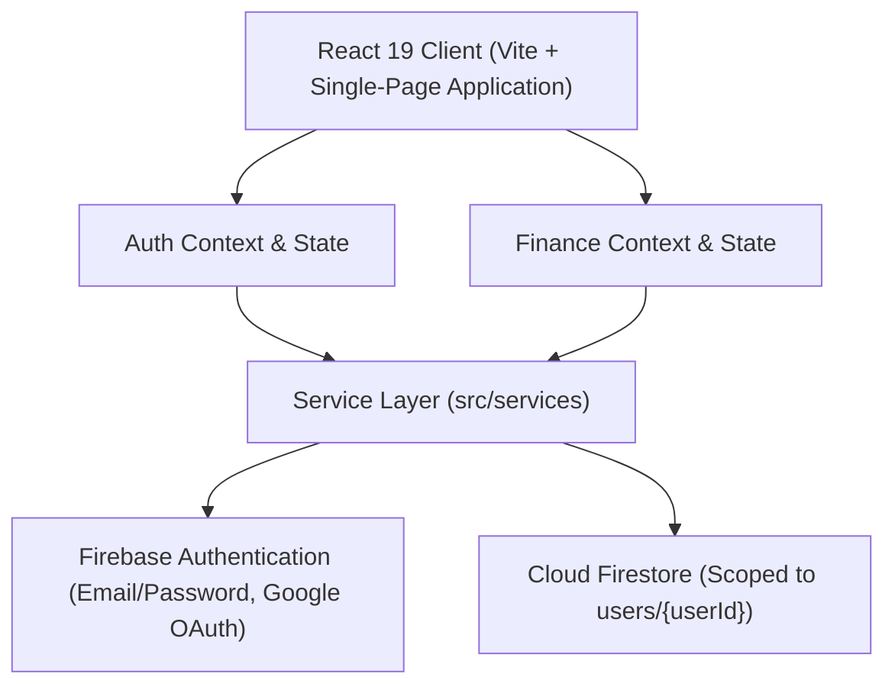
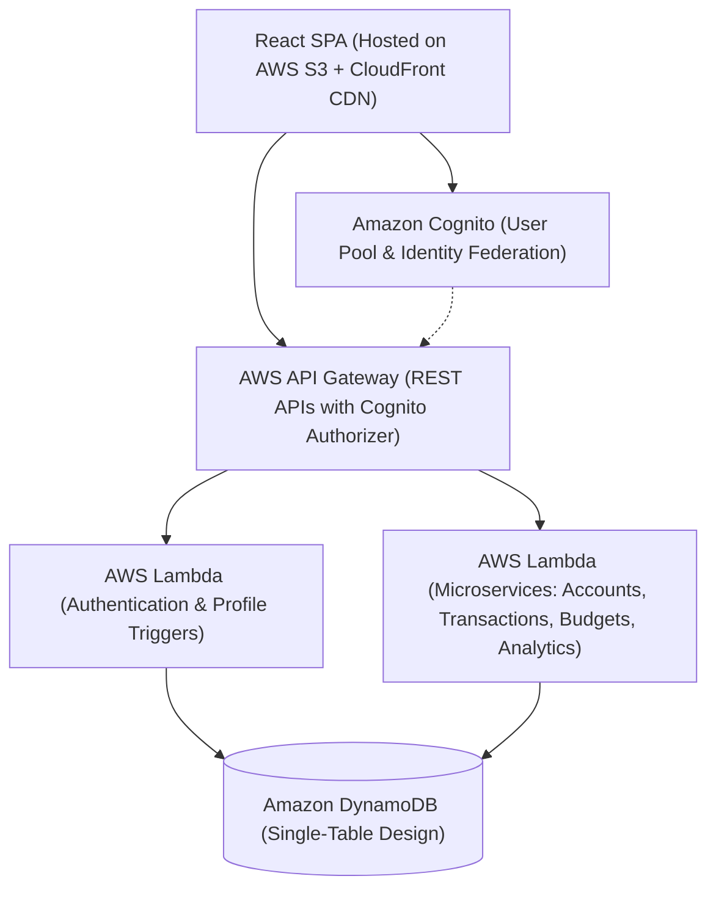

# KampusKash — System Architecture & Roadmap

This document outlines the current technical architecture of KampusKash (Phase 1 Foundation) and the planned cloud migration path for subsequent roadmap phases.

---

## 1. Current Architecture (Phase 1: Product Foundation)

KampusKash currently operates on a modern client-centric architecture backed by Google Firebase. All operations are isolated per authenticated student.



### Data Flow
1. **Presentation Layer (`src/views/`, `src/components/`)**: React 19 views consume unified hooks (`useFinance`, `useAuth`) without direct database queries.
2. **Context & State Management (`src/context/`)**: Maintains centralized financial state, memoized calculations, and optimistic UI updates.
3. **Service Layer (`src/services/`)**: Encapsulates all domain logic, validations, and data persistence:
   - `authService.js` — Authentication flows, credential validation, safe user display formatting.
   - `accountService.js` — Manual multi-account creation, validation, and balance aggregates.
   - `transactionService.js` — Income/expense records, account balance adjustments, filtering, and monthly aggregations.
   - `budgetService.js` — Category budget limits, usage tracking, and over-budget threshold calculation.
   - `savingsService.js` — Milestone targets, deposits, and progress calculation.
   - `profileService.js` — User profile sanitization (rejects UIDs/hashes) and Firestore sync.
   - `settingsService.js` — User preferences, theme settings, and onboarding tour status.
4. **Cloud Persistence (Cloud Firestore)**: Scoped strictly to `/users/{userId}` where `{userId} == request.auth.uid`.

---

## 2. Planned Future Architecture (Phase 2: AWS Migration)

In Phase 2, the application will migrate to AWS serverless infrastructure. Because Phase 1 introduced a modular service layer, the React frontend components remain unchanged; only the service layer will swap Firestore SDK calls for REST/GraphQL API invocations.



### Migration Mapping

| Component | Phase 1 (Current) | Phase 2 (Target AWS) |
|---|---|---|
| **Frontend Hosting** | GitHub Pages / Vercel | Amazon S3 + CloudFront |
| **Authentication** | Firebase Authentication + Google OAuth | Amazon Cognito User Pools + Google IdP |
| **API Layer** | Direct Firebase Client SDK | AWS API Gateway (HTTP/REST) |
| **Compute & Logic** | Client-side Services (`src/services/`) | AWS Lambda (Node.js 20+) |
| **Database** | Cloud Firestore (`users/{userId}`) | Amazon DynamoDB (Single-Table Architecture) |
| **Storage / Exports** | Client-side jsPDF / CSV blob | S3 Presigned URLs + Lambda PDF generation |

---

## 3. Data Model Design (Phase 1 & Phase 2 Compatibility)

The Firestore document schema in Phase 1 is explicitly designed to map directly into DynamoDB items in Phase 2:

### Document Path: `/users/{userId}`

```json
{
  "profile": {
    "username": "Airil Asyraff",
    "email": "student@campus.my",
    "university": "Campus Student",
    "currency": "RM"
  },
  "accounts": [
    {
      "accountId": "acc-1727800000-abc12",
      "accountName": "Maybank Savings",
      "institution": "Maybank",
      "accountType": "savings",
      "balance": 1250.00,
      "currency": "RM",
      "source": "manual",
      "createdAt": "2026-10-01T12:00:00.000Z",
      "updatedAt": "2026-10-01T12:00:00.000Z"
    }
  ],
  "transactions": [
    {
      "id": "tx-1727800000-xyz89",
      "type": "expense",
      "title": "Cafeteria Lunch",
      "amount": 8.50,
      "categoryId": "cat-6",
      "accountId": "acc-1727800000-abc12",
      "date": "2026-10-01",
      "source": "manual",
      "isRecurring": false,
      "note": "Lunch with friends",
      "createdAt": "2026-10-01T12:30:00.000Z",
      "updatedAt": "2026-10-01T12:30:00.000Z"
    }
  ],
  "budgets": [
    {
      "id": "b-1727800000",
      "categoryId": "cat-6",
      "monthlyLimit": 300.00,
      "createdAt": "2026-10-01T12:00:00.000Z",
      "updatedAt": "2026-10-01T12:00:00.000Z"
    }
  ],
  "savingsGoals": [
    {
      "id": "s-1727800000",
      "title": "New Laptop",
      "targetAmount": 3500.00,
      "currentAmount": 1750.00,
      "targetDate": "2026-12-31",
      "createdAt": "2026-10-01T12:00:00.000Z",
      "updatedAt": "2026-10-01T12:00:00.000Z"
    }
  ],
  "tutorialCompleted": true,
  "updatedAt": "2026-10-01T12:30:00.000Z"
}
```

### DynamoDB Single-Table Projection (Phase 2 Preview)
- `PK: USER#{userId}` | `SK: PROFILE`
- `PK: USER#{userId}` | `SK: ACCOUNT#{accountId}`
- `PK: USER#{userId}` | `SK: TX#{date}#{txId}`
- `PK: USER#{userId}` | `SK: BUDGET#{categoryId}`
- `PK: USER#{userId}` | `SK: GOAL#{goalId}`

---

## 4. Security & Compliance Rules

1. **User Isolation**:
   Every read and write in Firestore requires `request.auth.uid == userId`. No user can access or modify another student's financial records.
2. **No Banking Credentials Stored**:
   Phase 1 supports **manual** tracking only. KampusKash does **NOT** store bank passwords, PINs, OTPs, or session tokens.
3. **Phase 4 Roadmap Note**:
   Authorized bank integrations and Open Finance APIs will be introduced strictly in Phase 4 under licensed Open Banking protocols (e.g., PayNet / DuitNow Open Banking frameworks in Malaysia). No credential scraping will ever be used.

---

## 5. Phase 2 Readiness Evaluation

The Phase 1 architecture is **100% prepared** for Phase 2 AWS migration:
- **Clean Service Boundaries**: All Firestore database operations are isolated into `src/services/`.
- **Pure Financial Logic**: Financial aggregations, budget metrics, and savings percentages are pure functions that can run on Lambda or the client.
- **Normalized Data Shapes**: All entities have unique IDs, ISO timestamps, and standardized currency formats.
- **Stateless Frontend**: The UI depends solely on props and context, decoupling it from the backing infrastructure.
